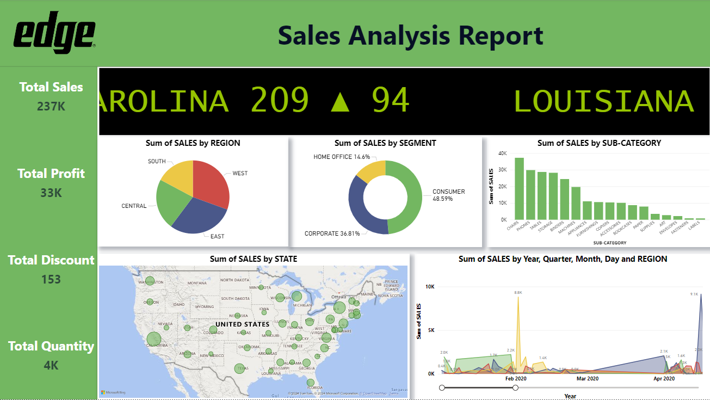

# **EdgesalesPowerBI**
This repository contains a Power BI dashboard designed to visualize and analyze sales data. The dashboard provides insights into various sales metrics, helping users understand sales performance, trends, and patterns.  

## **Sales Dashboard**
## **Overview** 

This repository houses a Power BI dashboard designed to provide insights into Edge sales performance. The dashboard leverages data processed through Python and Snowflake to offer interactive visualizations and key metrics.  

## **See the Full Dash Board Here** 

 
[Edge Analysis App PowerBI Link](https://app.powerbi.com/groups/me/reports/3109e288-75c6-4f86-bb84-0091e7133fc2/2939f8cb39420bd133ba?experience=power-bi)

## **Key Features** 

Comprehensive Sales Metrics: Total sales, profit, discounts, and quantity.  
Regional Analysis: Breakdown of sales by region, identifying top-performing areas.  
Segment Performance: Evaluation of sales contributions from different segments.  
State-Level Insights: Visual representation of sales by state.  
Time Series Analysis: Sales trends over time, including year, quarter, month, and day breakdowns.  

## **Data Pipeline** 

Python scripts for data extraction and transformation.    
Bulk data upload to Snowflake for efficient storage.   
Data integration into Power BI for visualization and analysis.    

## **Technology Stack**  

Python    
Snowflake  
Power BI  

## **Necessary Installations Before Running the Code**

```` pip install pandas ````
```` pip install snowflake-connector-python ````

If you're using a specific version of Python, you might need to install these libraries in a virtual environment to avoid conflicts with other projects.  

### **Potential Issues**
Snowflake: If you're using a custom module named snowflake, ensure it's in the same directory as your script or installed in a accessible location.  
Dependency Conflicts: If you encounter issues during installation, try using pip install -r requirements.txt with a requirements.txt file listing the dependencies.

### **Additional Considerations**  

Snowflake Credentials: Your Python code will likely require Snowflake account credentials (user, password, account, warehouse, database, schema) to establish a connection.  
Error Handling: Implement proper error handling mechanisms to gracefully handle exceptions during database operations.  
Data Loading: The code snippet doesn't provide details about data loading. Consider using pandas.DataFrame.to_sql() or other methods to load data into Snowflake.  

## **How to Use**  

Clone the repository: git clone https://github.com/abishekrajesh/EdgesalesPowerBI.git   
Set up environment: Configure Python environment and necessary libraries.  
Run Python scripts: Execute scripts to process data and upload to Snowflake.  
Import data into Power BI: Connect Power BI to Snowflake and import relevant data.  
Explore dashboard: Interact with the Power BI dashboard to gain insights.  

## **Contributing**  

Contributions to enhance the dashboard's functionality and visualizations are welcome. Please feel free to fork the repository and submit pull requests.  

## **License**

Permission is hereby granted, free of charge, to any person obtaining a copy of this software and associated documentation files (the "Software"), to deal in the Software without restriction, including without limitation the rights to use, copy, modify, merge, publish, distribute, sublicense, and/or sell copies of the Software, and to permit persons to whom the Software is furnished to do so, subject to the following conditions:  

The above copyright notice and this permission notice shall be included in all copies or substantial portions of the Software.  

THE SOFTWARE IS PROVIDED "AS IS", WITHOUT WARRANTY OF ANY KIND, EXPRESS OR IMPLIED, INCLUDING BUT NOT LIMITED TO THE WARRANTIES OF MERCHANTABILITY, FITNESS FOR A PARTICULAR PURPOSE AND NONINFRINGEMENT. IN NO EVENT SHALL THE X CONSORTIUM BE LIABLE FOR ANY CLAIM, DAMAGES OR OTHER LIABILITY, WHETHER IN AN ACTION OF CONTRACT, TORT OR OTHERWISE, ARISING FROM, OUT OF OR IN CONNECTION WITH THE SOFTWARE OR THE USE OR OTHER DEALINGS IN THE SOFTWARE.  
